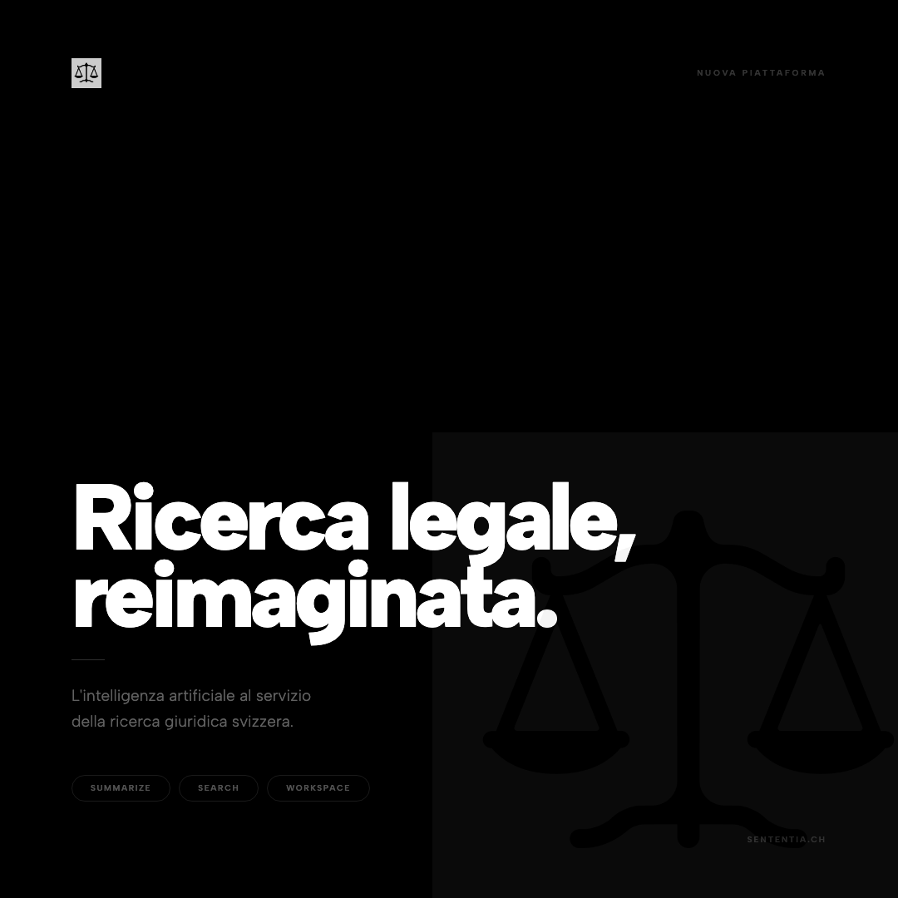

[](https://github.com/sententiaki/Sententia-plugin/releases)
[](LICENSE)
[](https://claude.ai)
[](https://sententia.ch)
[](https://mcp.opencaselaw.ch)

<p align="center">
  
</p>

<p align="center"><strong>Swiss Legal Document Generation Plugin for Claude Desktop</strong></p>

Sententia è un plugin Claude per studi legali svizzeri che automatizza la redazione di documenti legali. Descrivi il documento che vuoi — una diffida, un parere, un ricorso — e Sententia lo scrive sul tuo template di carta intestata con fonti giuridiche svizzere citate come note a piè di pagina (BGE/DTF con numero di considerando e pagina). Un secondo agente controlla il risultato in modo indipendente prima di consegnartelo.

Sententia include tutti gli agenti di ricerca di BetterCallClaude (ricerca precedenti, analisi strategica, analisi avversariale, citazioni, ecc.) — è un fork specializzato sulla generazione documentale.

---

## Diritto Svizzero, Non Delaware

Il plugin Legal ufficiale di Anthropic (`anthropics/knowledge-work-plugins`) copre il diritto contrattuale americano (Delaware, New York, California). **Sententia copre la Svizzera**: diritto federale, tutti i 26 cantoni, quattro lingue nazionali, citazioni verificate da fonti ufficiali, e protezione del segreto professionale (Anwaltsgeheimnis).

---

## Come Funziona

```
Tu scrivi:
  "Sententia, fammi una diffida di pagamento per il Sig. Rossi, CHF 5'000, 30 giorni"

Agente 1 — Redazione:
  → ricerca sentenze e basi legali rilevanti (BGE/DTF, Fedlex, commentari)
  → scrive il documento sulla tua carta intestata
  → inserisce le fonti come note a piè di pagina numerate
  → lascia [segnaposto] per i dati mancanti

Agente 2 — Review indipendente:
  → verifica la correttezza delle fonti citate
  → controlla la pertinenza delle sentenze
  → corregge eventuali errori

Output:
  → documento salvato in Sententia/output/Diffida-Rossi-2026-06-12.docx
  → aperto automaticamente in Word
```

---

## Agenti

| Agente | Funzione |
|---|---|
| **drafter** | Redige documenti legali su template con citazioni |
| **reviewer** | Controlla e corregge il documento in modo indipendente |
| **researcher** | Ricerca precedenti BGE/DTF e dottrina |
| **strategist** | Analisi strategica del caso |
| **adversary** | Analisi avversariale — argomenti della controparte |
| **advocate** | Costruisce la tesi più forte a favore |
| **citation** | Verifica e formatta le citazioni svizzere |
| **cantonal** | Ricerca giurisprudenza cantonale |
| **procedure** | Analisi procedurale (ZPO/CPC, StPO/CPP, VwVG) |
| **fiscal** | Diritto fiscale federale e cantonale |
| **corporate** | Diritto societario (AG/SA, GmbH/Sarl) |
| **realestate** | Diritto immobiliare e proprietà per piani |
| **compliance** | Conformità normativa (FINMA, GwG, FIDLEG) |
| **data-protection** | nDSG/FADP, GDPR |
| **translator** | Traduzione testi legali DE/FR/IT/EN |
| **summarizer** | Sintesi di decisioni e documenti |

---

## Comandi

| Comando | Descrizione |
|---|---|
| `/sententia:draft` | **Genera un documento legale su template** |
| `/sententia:research` | Ricerca precedenti e dottrina |
| `/sententia:legal` | Analisi legale completa |
| `/sententia:strategy` | Analisi strategica del caso |
| `/sententia:adversarial` | Analisi avversariale |
| `/sententia:cite` | Verifica e formatta una citazione |
| `/sententia:validate` | Valida le citazioni in un documento |
| `/sententia:translate` | Traduce un testo legale |
| `/sententia:doc-analyze` | Analizza un documento |
| `/sententia:cantonal` | Ricerca cantonale |
| `/sententia:federal` | Ricerca diritto federale |
| `/sententia:precedent` | Ricerca precedenti |
| `/sententia:briefing` | Briefing strutturato del caso |
| `/sententia:help` | Guida ai comandi |
| `/sententia:version` | Versione del plugin |

---

## MCP Server

Sententia si connette a 9 server MCP — tutti pubblici, senza API key, senza registrazione:

| Server | Dati | Endpoint |
|---|---|---|
| `swiss-caselaw` | 974.000+ decisioni federali e cantonali, 8M citazioni | `mcp.opencaselaw.ch` |
| `entscheidsuche` | Ricerca full-text sentenze | `mcp.bettercallclaude.ch` |
| `bge-search` | Ricerca BGE/ATF/DTF | `mcp.bettercallclaude.ch` |
| `fedlex-sparql` | 5.516 leggi federali (Fedlex SPARQL) | `mcp.bettercallclaude.ch` |
| `legal-citations` | Verifica e formattazione citazioni | `mcp.bettercallclaude.ch` |
| `onlinekommentar` | 1.058 commentari dottrinali | `mcp.bettercallclaude.ch` |
| `legal-persona` | Strategia, drafting, analisi documenti | `mcp.bettercallclaude.ch` |
| `tas-jurisprudence` | Arbitrato sportivo CAS/TAS | `mcp.bettercallclaude.ch` |
| `ollama` | Traduzione e sintesi locale (privacy) | localhost |

---

## Installazione

### Claude Desktop (Cowork)

1. Apri Claude Desktop → **Customize** → **Browse Plugins**
2. Clicca **Personal** → **+** → **Add from GitHub**
3. Inserisci: `sententiaki/Sententia-plugin`
4. Clicca **Install** → **Continue**
5. Nelle impostazioni del plugin, imposta:
   - **Letterhead template path**: percorso del tuo file `.docx` di carta intestata
   - **Output folder path**: cartella dove salvare i documenti generati
   - **Default canton**: es. `TI`
   - **Output language**: `IT`

### Configurazione template

Sententia usa il tuo template Word come base per ogni documento. Il template deve contenere la carta intestata dello studio (logo, nome, indirizzo, ecc.). Il contenuto del documento — titolo, corpo, note a piè di pagina — viene generato automaticamente.

Guarda `templates/` per esempi di template compatibili.

---

## Privacy e Segreto Professionale

Sententia include un sistema di rilevamento del segreto professionale (Anwaltsgeheimnis — Art. 321 StGB). Prima di inviare dati ai server MCP, il plugin verifica se il contenuto contiene marcatori di privilegio avvocato-cliente e chiede conferma.

Tre modalità:
- **balanced** (default): chiede conferma su marcatori forti e deboli
- **strict**: blocca tutto il contenuto non-Ollama con marcatori di privilegio
- **cloud**: chiede conferma solo su marcatori forti

I documenti generati restano sempre sul tuo computer. Il plugin non ha un backend proprio.

> **Nota**: le query inviate ai server MCP (ricerche di sentenze, testo delle richieste) transitano attraverso Claude Desktop e i server Anthropic. Valuta la compatibilità con le norme deontologiche del tuo ordinamento prima di includere dati identificativi dei clienti nelle query.

---

## Struttura del Repository

```
sententia/                  Il plugin Claude Desktop
├── .claude-plugin/         plugin.json — manifest del plugin
├── .mcp.json               Dichiarazione server MCP
├── agents/                 16 agenti (file .md con frontmatter YAML)
├── commands/               15 comandi slash
├── skills/                 12 skill (SKILL.md per directory)
├── hooks/                  Hook Cowork Desktop (privacy)
├── scripts/                privacy-check.js
└── mcp-servers/ollama/     Server MCP locale STDIO (Ollama)

docs/                       Documentazione tecnica
templates/                  Template Word compatibili
```

---

## Licenza

AGPL-3.0 — vedi [LICENSE](LICENSE).

Basato su [BetterCallClaude](https://github.com/fedec65/bettercallclaude) di Federico Cesconi.
I dati giuridici provengono da [OpenCaseLaw.ch](https://opencaselaw.ch) (CC0) e [Fedlex](https://fedlex.admin.ch) (open government data).
